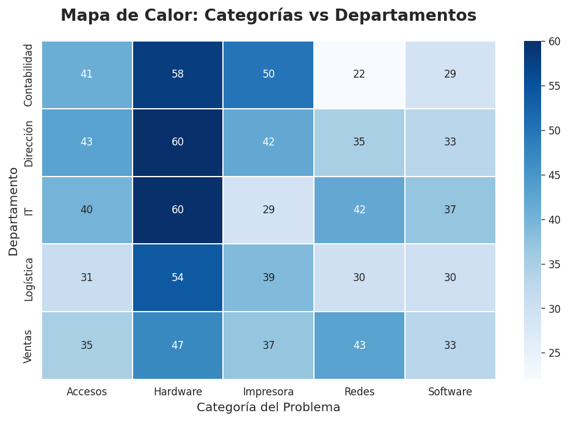

# 📊 Análisis de Tickets de Soporte IT

## 📝 Descripción del Proyecto
Este proyecto simula un entorno real de soporte técnico donde se analizó un dataset de **1,000 tickets** con datos "sucios". El objetivo fue limpiar la información, estandarizar categorías y detectar ineficiencias operativas.

## 🛠️ Herramientas Utilizadas
* **Python (Pandas):** Limpieza de datos, eliminación de duplicados y manejo de valores nulos.
* **Seaborn / Matplotlib:** Visualización de datos y diseño de gráficas.
* **Google Colab:** Entorno de desarrollo.

## 🔍 Hallazgos Principales

### 1. Carga de Trabajo por Departamento
Se identificó que el departamento de **Direccion** e **IT** generan el mayor volumen de tickets, lo que sugiere necesidad de capacitación o revisión de equipos en esas áreas.

### 2. Mapa de Calor de Problemas
El análisis detallado muestra que los problemas de **Hardware** son críticos en ciertos departamentos, mientras que **Acceso** es un problema recurrente general.

## 🚀 Conclusión
A través de la limpieza de datos, se logró recuperar el 90% de la información útil del dataset original, permitiendo a la gerencia tomar decisiones basadas en datos reales y no en suposiciones.
